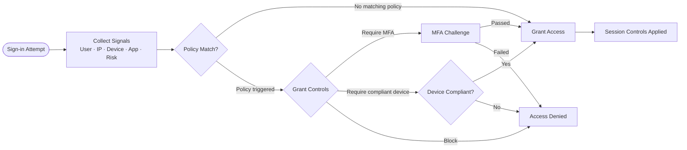
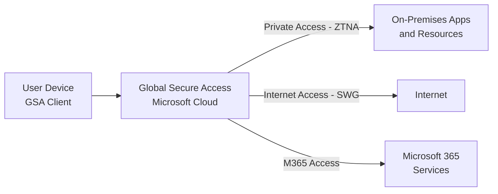

# SC-300 - Implement Authentication and Access Management

!!! info "Exam Weight"
    This topic accounts for approximately **25–30%** of the SC-300 exam.

← **Back to:** [SC-300 Index](index.md)

---

## Authentication Methods

Microsoft Entra ID supports a range of authentication methods from traditional passwords to fully passwordless options.

| Method | Description | Passwordless? |
|--------|-------------|---------------|
| **Password** | Basic, weakest form | No |
| **MFA (TOTP)** | Time-based one-time passcode via app | No |
| **Microsoft Authenticator** | Push notification or passwordless phone sign-in | Yes (passwordless mode) |
| **Windows Hello for Business** | Biometric or PIN, device-bound | Yes |
| **FIDO2 security keys** | Physical hardware key (e.g. YubiKey) | Yes |
| **Certificate-based Authentication (CBA)** | X.509 certificates, satisfies MFA | Yes |
| **Temporary Access Pass (TAP)** | Time-limited passcode for onboarding or recovery | — |
| **SSPR** | Users reset their own passwords securely | — |

### Temporary Access Pass (TAP)

- A time-limited, one-time (or multi-use) passcode issued by an admin.
- Used to **onboard users** to passwordless methods, or for **account recovery**.
- Cannot be used as an MFA factor itself — it *bootstraps* passwordless registration.

### Microsoft Entra Password Protection

- Blocks **weak and banned passwords** (global banned list + custom banned list).
- Works for both **cloud-only** and **on-premises** AD (via an agent on domain controllers).

### MFA Settings

- **Tenant-wide MFA** — Configure defaults for all users (e.g., Security Defaults or per-user MFA — legacy).
- Modern approach: enforce MFA via **Conditional Access policies** instead of per-user MFA settings.
- **Registration campaigns** — Nudge users to register for stronger MFA methods (e.g., Authenticator app).

### Microsoft Entra Kerberos

Enables **hybrid identities** to use Kerberos-based SSO for cloud resources (e.g., accessing on-premises shares via Azure Files using cloud credentials).

---

## Conditional Access

**Conditional Access** is the if-then policy engine at the heart of Zero Trust access control.

> "If a user in condition X tries to access resource Y, then require/block/grant with control Z."

### Signals (Conditions)

| Signal | Examples |
|--------|---------|
| **User / Group** | Specific users, groups, or roles |
| **Cloud app** | Which application is being accessed |
| **IP / Location** | Named locations, country-based filtering |
| **Device platform** | Windows, iOS, Android |
| **Device state** | Compliant, Entra-joined, Hybrid-joined |
| **Sign-in risk** | Low / Medium / High (from ID Protection) |
| **User risk** | Leaked credentials, anomalous behaviour |
| **Authentication context** | Require step-up auth for sensitive actions |

### Grant Controls

| Control | Description |
|---------|-------------|
| **Require MFA** | Force MFA for matching sign-ins |
| **Require compliant device** | Device must pass Intune compliance policy |
| **Require Hybrid Entra Joined device** | Device must be domain-joined + registered |
| **Require approved client app** | Only specific apps (e.g. Outlook mobile) |
| **Require app protection policy** | Intune MAM policy must be applied |
| **Block access** | Deny all access |

### Session Controls

| Control | Description |
|---------|-------------|
| **Sign-in frequency** | How often users must re-authenticate |
| **Persistent browser session** | Whether "stay signed in" is allowed |
| **App-enforced restrictions** | SharePoint / Exchange apply their own session limits |
| **Conditional Access App Control** | Route traffic through Defender for Cloud Apps proxy |
| **Continuous Access Evaluation (CAE)** | Real-time token revocation (e.g., on IP change, account disable) |

### Protected Actions

Apply **step-up MFA** to specific high-risk Entra operations (e.g., deleting a tenant, modifying Conditional Access) — separate from regular MFA at sign-in.

### Conditional Access Templates

Microsoft provides pre-built CA policy templates covering common scenarios (e.g., "Require MFA for all users", "Block legacy authentication"). Good starting point — always test in **report-only mode** first.

> **Exam tip:** Always test CA policies in **report-only mode** before enforcing, to avoid locking out users.

---

## Microsoft Entra ID Protection

Detects identity-based risks using machine learning and threat intelligence.

### Risk Types

| Risk Type | Examples |
|-----------|---------|
| **User risk** | Leaked credentials on dark web, anomalous user behaviour |
| **Sign-in risk** | Anonymous IP, atypical travel, malware-linked IP, password spray |
| **Workload identity risk** | Suspicious behaviour from service principals or managed identities |

### Risk Levels

Low → Medium → High

### Remediation Actions

- **User risk policy** (via ID Protection or Conditional Access): Require password reset, block.
- **Sign-in risk policy**: Require MFA, block.
- **Admin remediation**: Manually dismiss or confirm compromise.

### Monitoring and Investigation

- Review **Risky users** and **Risky sign-ins** reports.
- Investigate individual sign-in details, detection reasons, and history.
- Confirm compromise or dismiss false positives.

> Requires **Microsoft Entra ID P2**.

---

## Global Secure Access

**Global Secure Access** is Microsoft's **Security Service Edge (SSE)** solution — bringing Zero Trust Network Access (ZTNA) and Secure Web Gateway capabilities to Microsoft Entra.

### Components

| Component | Description |
|-----------|-------------|
| **Microsoft Entra Private Access** | ZTNA replacement for VPN — provides access to private on-premises and cloud apps without requiring a VPN client |
| **Microsoft Entra Internet Access** | Secure Web Gateway (SWG) — filters and controls internet-bound traffic |
| **Internet Access for Microsoft 365** | Optimised, secure path for Microsoft 365 traffic |

### Global Secure Access Client

A lightweight agent installed on user devices that routes traffic through the Global Secure Access service.

> **Key exam point:** Global Secure Access is a **Conditional Access-aware** service — policies apply to traffic routed through it.