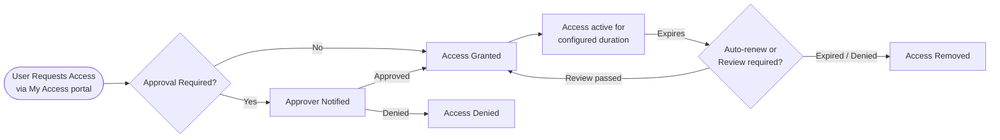
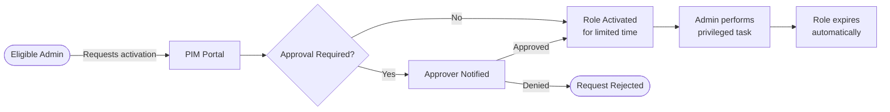

# SC-300 - Plan and Automate Identity Governance

!!! info "Exam Weight"
    This topic accounts for approximately **20–25%** of the SC-300 exam.

← **Back to:** [SC-300 Index](index.md)

---

## Identity Governance Overview

Identity Governance answers the question: **Who has access to what, and should they still have it?**

Microsoft Entra ID Governance covers:
- **Entitlement Management** — How access is requested and granted.
- **Access Reviews** — Whether existing access is still appropriate.
- **Privileged Identity Management (PIM)** — Control over privileged roles.
- **Lifecycle Workflows** — Automate joiner/mover/leaver processes.

---

## Entitlement Management

**Entitlement Management** automates access request workflows using **access packages** and **catalogs**.

### Key Concepts

| Concept | Description |
|---------|-------------|
| **Catalog** | A container for resources and access packages; can be delegated to non-admin owners |
| **Access Package** | A bundle of resources (groups, apps, SharePoint sites) that users can request access to |
| **Policy** | Defines who can request access, approval steps, duration, and expiry |
| **Connected Organisation** | An external Entra tenant or domain whose users can request access |

### Access Package Lifecycle



### Terms of Use (ToU)

- Require users to **accept terms** before accessing an application or resource.
- Configured in Entra ID and enforced via **Conditional Access**.
- Supports different versions and per-language documents.

### External User Lifecycle

- When an external user's last access package expires, their guest account can be **automatically removed** from the tenant.
- Configurable per connected organisation or globally.

---

## Access Reviews

**Access Reviews** periodically verify whether users still need their current access to groups, apps, or roles.

### Review Types

| Scope | Who Reviews |
|-------|-------------|
| **Group membership** | Group owner, manager, or selected reviewers |
| **App assignment** | App owner or selected reviewers |
| **Entra ID roles** | Privileged role members (PIM-aware) |
| **Azure resource roles** | Resource owners |

### Review Settings

- **Self-review** — Users confirm their own access.
- **Manager review** — Each user's manager reviews.
- **Auto-apply results** — Automatically remove access when reviewers deny or do not respond.
- **Duration** — Set how long the review window stays open.

### Monitoring

- Track progress in the Entra admin center.
- Manually apply results if auto-apply is not configured.

> Requires **Microsoft Entra ID P2**.

---

## Privileged Identity Management (PIM)

**PIM** provides **Just-In-Time (JIT)** privileged access — users only have elevated permissions when they explicitly need them, for a limited time.

### What PIM Covers

- **Microsoft Entra ID roles** (e.g., Global Administrator, User Administrator)
- **Azure resource roles** (e.g., Owner, Contributor on subscriptions/resource groups)
- **PIM for Groups** — Control membership in privileged groups (e.g., groups used as role assignees)

### Role Assignment Types

| Type | Description |
|------|-------------|
| **Eligible** | User can *activate* the role when needed; not active by default |
| **Active** | User has the role active continuously (use sparingly) |
| **Time-bound** | Either eligible or active, but only for a set period |

### Activation Flow



### PIM Settings (per role)

- **Require MFA on activation** — Yes/No
- **Require justification** — Admins must provide a reason
- **Require approval** — Who approves activation requests
- **Maximum activation duration** — e.g., 4 hours
- **Notification on activation** — Alert security team

### Break-Glass Accounts

**Break-glass accounts** (also called emergency access accounts) are:
- Highly privileged accounts (typically Global Administrator).
- Excluded from MFA and Conditional Access policies.
- Used **only** when normal admin access is lost (e.g., MFA outage, misconfigured CA policy).
- Monitored with **alerts on any sign-in activity**.
- Credentials stored offline, split between trusted individuals.

> **Key exam point:** Break-glass accounts must be excluded from any CA policy that could lock out all admins.

### PIM Audit History

- All activation requests, approvals, and role changes are logged.
- Accessible from the PIM portal — useful for compliance and investigations.

---

## Monitoring Identity Activity

### Log Types in Entra ID

| Log | Contains |
|-----|---------|
| **Sign-in logs** | All authentication attempts (interactive, non-interactive, service principal, managed identity) |
| **Audit logs** | All administrative changes in Entra ID (user created, role assigned, policy changed) |
| **Provisioning logs** | Sync events from HR-driven provisioning, cloud sync, or SCIM provisioning |

### Diagnostic Settings

Logs can be exported to:
- **Log Analytics Workspace** — For KQL querying, workbooks, and alerts.
- **Storage Account** — For long-term archiving.
- **Azure Event Hub** — For streaming to third-party SIEMs (e.g., Splunk).

### KQL Queries in Log Analytics

Use **Kusto Query Language (KQL)** to query Entra ID logs:

```kql
// Find all failed sign-ins in the last 24 hours
SigninLogs
| where TimeGenerated > ago(24h)
| where ResultType != 0
| project TimeGenerated, UserPrincipalName, AppDisplayName, ResultDescription, IPAddress
| order by TimeGenerated desc
```

### Workbooks

Pre-built and custom **Azure Monitor Workbooks** visualise Entra ID data:
- Sign-in analysis
- Conditional Access insights
- MFA usage reports
- Risk detections

### Identity Secure Score

A **numeric score** measuring the security posture of your Entra ID configuration — similar to Microsoft Defender for Cloud's Secure Score but focused on identity.

- Higher score = better identity security posture.
- Provides **improvement actions** with step-by-step guidance.
- Tracks progress over time.
