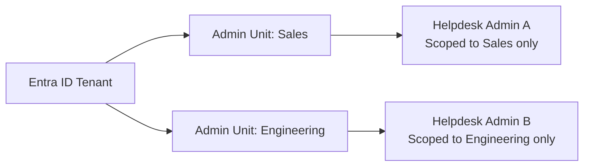
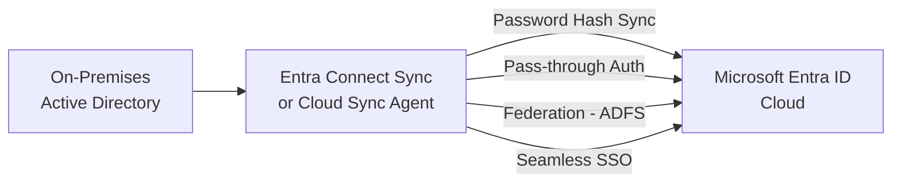

# SC-300 - Module 1: Implement and Manage User Identities

!!! info "Exam Weight"
    This topic accounts for approximately **20–25%** of the SC-300 exam.

← **Back to:** [SC-300 Index](index.md)

---

## Microsoft Entra Tenant Configuration

The **tenant** is the top-level container for all identity objects in Microsoft Entra ID. Configuring it correctly is foundational to everything else.

### Entra Roles

| Role Type | Description |
|-----------|-------------|
| **Built-in roles** | Pre-defined roles (e.g., Global Administrator, User Administrator, Helpdesk Administrator) |
| **Custom roles** | Defined with specific permission sets for fine-grained delegation |

!!! Tip
    Use the principle of least privilege — assign the narrowest role that meets the requirement. Evaluate **effective permissions** to account for role combinations.

### Administrative Units (AUs)

**Administrative Units** are containers that scope the permissions of administrators to a subset of users, groups, or devices.

- Example: An AU for the "Sales department" lets a Helpdesk Admin reset passwords *only* for Sales users.
- Use AUs when you need delegated admin without granting tenant-wide permissions.

### Other Tenant Settings

- **Domains** — Add and verify custom domains (e.g., contoso.com) in Entra ID.
- **Company branding** — Customise the sign-in page with logo, colours, and background.
- **User settings** — Control whether users can register applications, consent to apps, etc.
- **Group settings** — Configure self-service group management.
- **Device settings** — Control device join and registration options.

---

## Managing Entra Identities (Users and Groups)

### Users

- Create users manually, via bulk import (CSV), or via PowerShell / Microsoft Graph.
- **Custom security attributes** — Flexible attribute extensions on user objects, used for access control or filtering. Different from extension attributes.
- Manage **licenses** directly on users or via group-based licensing.

### Groups

| Type | Description |
|------|-------------|
| **Security group** | Used for access to resources |
| **Microsoft 365 group** | Collaboration group with mailbox, Teams, SharePoint |
| **Assigned** | Members added manually |
| **Dynamic** | Members added automatically based on attribute rules (e.g., department = "Sales") |

### Device Management

| Method | Description |
|--------|-------------|
| **Microsoft Entra Registered** | Personal (BYOD) devices; user signs in with personal account |
| **Microsoft Entra Joined** | Corporate devices joined to Entra ID only (no on-prem AD required) |
| **Hybrid Entra Joined** | Devices joined to both on-premises AD and Entra ID |

---

## External Identities

### B2B Collaboration

External business partners can access your apps using **their own organisation's credentials** (guest accounts in your tenant).

- Invite individually or in bulk.
- Manage via **External collaboration settings** (control who can invite guests, what domains are allowed/blocked).

### Cross-Tenant Access Settings

Control inbound and outbound B2B collaboration between specific Entra tenants:

- **Inbound** — What external users from Tenant B can access in your tenant.
- **Outbound** — What your users can access in Tenant B.
- Supports **Trust settings** (trust MFA claims from partner tenant).

### Cross-Tenant Synchronisation

Automatically synchronise users from one Entra tenant to another — useful for large enterprises with multiple tenants.

### External Identity Providers

Support federated sign-in using:

- **SAML 2.0** — Standard federation protocol.
- **WS-Federation** — Older but still supported protocol.
- Social identity providers (Google, Facebook) for B2C scenarios.

---

## Hybrid Identity

Organisations with **on-premises Active Directory** need to synchronise identities to Entra ID. Microsoft offers two tools:

### Microsoft Entra Connect Sync

The traditional on-premises sync agent.

| Feature | Description |
|---------|-------------|
| **Password Hash Sync (PHS)** | Hash of on-prem password synced to cloud. Enables cloud sign-in. |
| **Pass-through Authentication (PTA)** | Password validated against on-prem AD in real time; hash never stored in cloud. |
| **Federation (AD FS)** | Full federation; sign-in fully managed by on-prem AD FS infrastructure. |
| **Seamless SSO** | Automatically signs in users on domain-joined devices without re-prompting. |

### Microsoft Entra Cloud Sync

A **lighter, cloud-managed** sync agent — replaces some scenarios where Entra Connect Sync was used.

- Runs as a lightweight agent on-premises.
- Supports multi-forest scenarios more easily.
- Does **not** support all features of Entra Connect Sync (e.g., some hybrid Exchange scenarios).

### Microsoft Entra Connect Health

Monitors the health of your hybrid identity infrastructure:

- Monitors Entra Connect Sync, AD FS, and AD DS.
- Alerts on sync errors, latency, and service issues.
- Accessible from the Entra admin center.

### Migrating from AD FS

Microsoft recommends migrating away from AD FS to:

- **Password Hash Sync** — Recommended for most organisations (resilient, cloud-only dependency).
- **Pass-through Authentication** — When passwords must never leave on-prem.

> **Key exam point:** PHS is the most resilient option because sign-in continues even if on-prem infrastructure is unavailable.
