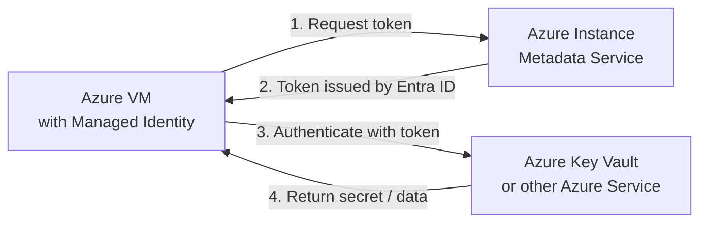
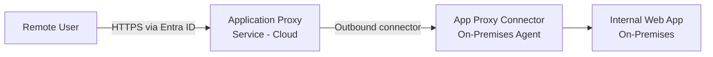

# SC-300 - Plan and Implement Workload Identities

!!! info "Exam Weight"
    This topic accounts for approximately **20–25%** of the SC-300 exam.

← **Back to:** [SC-300 Index](index.md)

---

## What Are Workload Identities?

**Workload identities** are identities assigned to **non-human** entities — applications, services, and Azure resources — so they can authenticate and access other resources.

| Identity Type | Description | Use Case |
|---------------|-------------|----------|
| **Managed Identity** | Azure-managed service identity; no credentials to manage | Azure VM accessing Key Vault |
| **Service Principal** | Application identity in Entra ID; has credentials (secret or certificate) | Non-Azure app authenticating to Entra |
| **User account** | Regular user used as a service account (not recommended) | Legacy scenarios only |
| **Managed Service Account** | Windows-based gMSA; on-premises | On-prem Windows services |

---

## Managed Identities

**Managed Identities** let Azure resources authenticate to other Azure services **without storing credentials** in code or configuration.

### Types

| Type | Description |
|------|-------------|
| **System-assigned** | Created and tied to a single resource; deleted when the resource is deleted |
| **User-assigned** | Created independently; can be assigned to one or more resources; lifecycle managed separately |

### How It Works

### Assigning a Managed Identity to Access Resources

1. Enable managed identity on the Azure resource (e.g., a VM or Function App).
2. Grant the managed identity a **role assignment** (RBAC) on the target resource (e.g., Key Vault Secrets User).
3. The application code uses the managed identity token — no credentials in code.

> **Key exam point:** Prefer **user-assigned managed identities** when the same identity needs to be assigned to multiple resources, or when the lifecycle of the identity should be independent of the resource.

---

## Enterprise Applications and Service Principals

When an application is registered in Entra ID, two objects are created:

| Object | Tenant | Purpose |
|--------|--------|---------|
| **App Registration** | Home tenant (where app is registered) | Defines the app — its permissions, credentials, redirect URIs |
| **Service Principal** | Every tenant where the app is used | The app's identity in that specific tenant — used for access control and consent |

### Enterprise Application Settings

- **User assignment required** — If enabled, only assigned users/groups can sign in to the app.
- **Visible to users** — Whether the app appears in My Apps portal.
- **Provisioning** — Automatic user provisioning to the app using SCIM.

### Application Proxy

**Microsoft Entra Application Proxy** provides secure remote access to **on-premises web applications** without a VPN.

- The connector is installed on-prem and makes **outbound** connections only — no inbound firewall rules needed.
- Supports **header-based**, **Kerberos-based**, and **password-based** SSO to internal apps.
- Also supports **pre-authentication** via Entra ID (users must authenticate before reaching the app).

### SaaS App Integration

Entra ID integrates with thousands of SaaS apps via the **application gallery**:
- **Federated SSO** (SAML / OIDC) — preferred; Entra ID is the identity provider.
- **Password-based SSO** — Entra vaults credentials and replays them.
- **Linked SSO** — Just a link to an existing SSO system.

---

## App Registrations

App registrations define the **identity and configuration** of an application in Entra ID.

### Key Components

| Component | Description |
|-----------|-------------|
| **Client ID** | Unique identifier for the application |
| **Redirect URIs** | Where Entra ID returns tokens after authentication |
| **Certificates & Secrets** | Credentials used by the app to authenticate (prefer certificates over secrets) |
| **API permissions** | What Microsoft APIs or custom APIs the app can call |
| **App roles** | Custom roles that can be assigned to users or other apps |
| **Expose an API** | Define scopes so other apps can access this app's API |

### Permission Types

| Type | Description |
|------|-------------|
| **Delegated permissions** | App acts on behalf of a signed-in user; limited to what the user can do |
| **Application permissions** | App acts as itself (no user involved); requires admin consent |

### Admin vs. User Consent

- **User consent** — User can grant delegated permissions themselves (if allowed by tenant settings).
- **Admin consent** — Required for application permissions and high-privilege delegated permissions.

---

## Microsoft Defender for Cloud Apps (App Monitoring)

**Defender for Cloud Apps** (a CASB) is used in SC-300 specifically for **monitoring and controlling application access**.

### Cloud Discovery

- Analyses network traffic to discover all cloud apps in use (**Shadow IT**).
- Apps are scored for risk based on 90+ criteria.

### Connected Apps

Integrate sanctioned apps with Defender for Cloud Apps via API connectors for deeper visibility and control.

### Conditional Access App Control

Routes app traffic through Defender for Cloud Apps as a **reverse proxy**, enabling:
- **Session policies** — Monitor or block specific in-session actions (e.g., download, print, copy).
- **Access policies** — Block access based on conditions (e.g., unmanaged device).

### OAuth App Policies

Detect and manage risky OAuth apps that have been granted permissions by users — helps prevent OAuth phishing.
