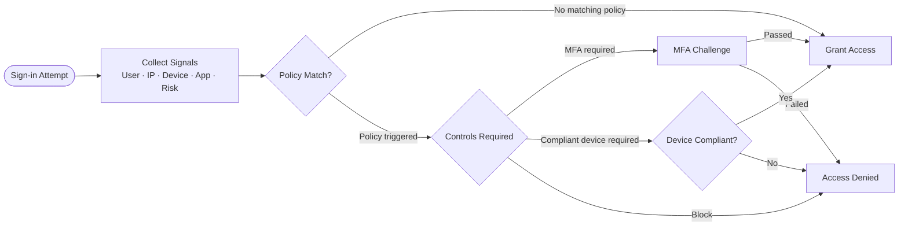
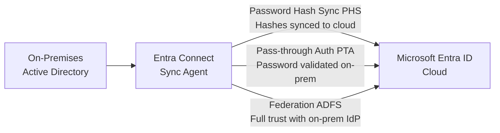

# SC-900 - Identity and Access

!!! info "Exam Weight"
    This topic accounts for approximately **25–30%** of the SC-900 exam.

← **Back to:** [SC-900 Index](index.md)

---

## What Is Identity?

Identity is the **new security perimeter**. In a cloud-first world, identity replaces the traditional network perimeter.

> "Identity is the foundation of Zero Trust." → [Zero Trust Model](sc-900-security-concepts.md#zero-trust-model)

---

## Authentication vs. Authorisation

| Concept | Question | Example |
|---------|----------|---------|
| **Authentication (AuthN)** | *Who are you?* | Login with username + password |
| **Authorisation (AuthZ)** | *What are you allowed to do?* | RBAC role assignment |

---

## Microsoft Entra ID (formerly Azure Active Directory)

**Microsoft Entra ID** is Microsoft's cloud-based Identity and Access Management (IAM) service.

### What It Does
- Manages users, groups, and applications.
- Provides Single Sign-On (SSO).
- Supports Multi-Factor Authentication (MFA).
- Enables Conditional Access.

### Editions

| Edition | Features |
|---------|----------|
| **Free** | Basic SSO, user management, Entra Connect sync |
| **P1** | Conditional Access, self-service password reset (SSPR) |
| **P2** | Privileged Identity Management (PIM), Identity Protection |

> **Note:** Microsoft 365 includes Entra ID Free.

---

## Authentication Methods

| Method | Description |
|--------|-------------|
| **Password** | Basic, weakest form |
| **MFA** | Requires 2+ verification factors |
| **Windows Hello for Business** | Biometric / PIN-based on devices |
| **FIDO2 security keys** | Hardware keys, passwordless |
| **Microsoft Authenticator app** | Push notification, passwordless |
| **SSPR** | Users reset their own passwords securely |
| **Certificate-based authentication** | Uses digital certificates |

### MFA Factors

1. **Something you know** — Password, PIN
2. **Something you have** — Phone, hardware token
3. **Something you are** — Fingerprint, face recognition

---

## Conditional Access

**Conditional Access** = If-Then policy engine. "If user is in X condition, then require Y."

### Common Signals
- User identity / group membership
- IP location
- Device compliance
- Application being accessed
- Real-time risk detection

### Common Controls
- Require MFA
- Block access
- Require compliant device
- Require Entra ID joined device

> Requires **Entra ID P1** or higher.

---

## Privileged Identity Management (PIM)

**PIM** enables Just-In-Time (JIT) privileged access to Azure AD and Azure resources.

- Users request elevated access for a limited time.
- Requires approval and justification.
- All activity is logged and audited.
- Reduces risk of standing privileged access.

> Requires **Entra ID P2**.

---

## Identity Protection

**Microsoft Entra ID Protection** detects identity-based risks using machine learning.

| Risk Type | Example |
|-----------|---------|
| **User risk** | Leaked credentials found on dark web |
| **Sign-in risk** | Sign-in from anonymous IP, atypical travel |

Actions: block, require MFA, require password reset.

> Requires **Entra ID P2**.

---

## External Identities

| Feature | Use Case |
|---------|----------|
| **B2B Collaboration** | External business partners access your apps with their own identity |
| **B2B Direct Connect** | Federated trust with another Entra tenant (Teams shared channels) |
| **B2C** | Customer identity management for consumer-facing apps |

---

## Hybrid Identity — Microsoft Entra Connect

**Entra Connect** (formerly Azure AD Connect) synchronises on-premises Active Directory to Entra ID.

- **Password Hash Synchronisation (PHS)** — Syncs password hashes to the cloud.
- **Pass-through Authentication (PTA)** — Validates password against on-prem AD in real time.
- **Federation (ADFS)** — Full federation with on-prem infrastructure.

---

## Role-Based Access Control (RBAC)

Assign roles to users/groups to control what they can do.

| Scope | Example |
|-------|---------|
| Management Group | Apply policy to multiple subscriptions |
| Subscription | Assign Owner role for an entire subscription |
| Resource Group | Contributor role for a resource group |
| Resource | Reader role for a single storage account |

> RBAC is used for Azure **resources**. For Entra ID directory roles, use **Entra roles**.

---

## Governance — Access Reviews

**Access Reviews** periodically review whether users still need access to resources or groups.
- Can be self-reviewed or reviewed by managers.
- Available in Entra ID P2.