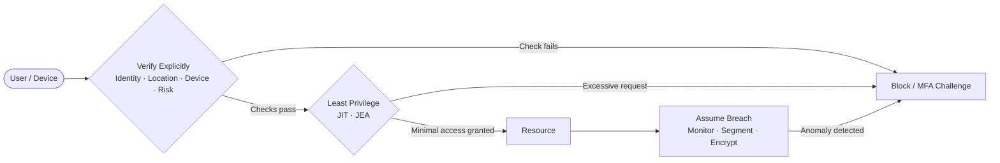
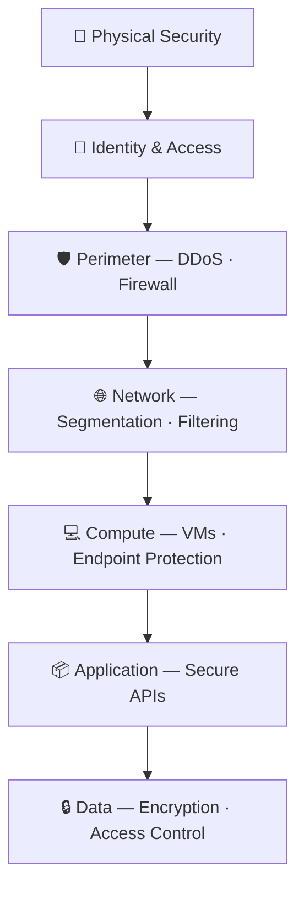

# SC-900 - Security Concepts

!!! info "Exam Weight"
    This topic accounts for approximately **10–15%** of the SC-900 exam.

← **Back to:** [SC-900 Index](index.md)

---

## Shared Responsibility Model

The **Shared Responsibility Model** defines what Microsoft manages and what the customer is responsible for depending on the service type.

| Responsibility | On-Premises | IaaS | PaaS | SaaS |
|----------------|-------------|------|------|------|
| Data & Access | Customer | Customer | Customer | Customer |
| Application | Customer | Customer | Customer | Microsoft |
| OS & Runtime | Customer | Customer | Microsoft | Microsoft |
| Network & Hardware | Customer | Microsoft | Microsoft | Microsoft |
| Physical datacenter | Customer | Microsoft | Microsoft | Microsoft |

> **Key Rule:** The customer is **always** responsible for data, accounts, and access management — regardless of cloud model.

---

## Zero Trust Model

**Zero Trust** assumes breach and never implicitly trusts anything inside or outside the network perimeter.

### Three Core Principles

1. **Verify explicitly** — Always authenticate and authorize based on all available data points (identity, location, device, service, workload, data classification).
2. **Use least privilege access** — Limit user access with Just-In-Time (JIT) and Just-Enough-Access (JEA).
3. **Assume breach** — Minimize blast radius, segment access, and verify end-to-end encryption.

### Six Pillars of Zero Trust

- **Identities** → [Module 2 - Identity and Access](sc-900-identity-and-access.md)
- **Devices** — Only compliant, managed devices access resources.
- **Applications** — Discover all applications in use (shadow IT).
- **Data** — Classify, label, and protect data.
- **Infrastructure** — Monitor telemetry to detect anomalies.
- **Networks** — Segment, monitor, and encrypt all network communication.

---

## Defense in Depth

A layered security strategy where multiple controls protect against a breach at any single layer.

**Layers (outside → inside):**

1. Physical security
2. Identity & access ([Module 2 - Identity and Access](sc-900-identity-and-access.md))
3. Perimeter (DDoS protection, firewalls)
4. Network (segmentation, traffic filtering)
5. Compute (secure VMs, endpoint protection)
6. Application (secure APIs, no secrets in code)
7. Data (encryption, access control)

> Each layer provides additional protection and slows down an attacker.

---

## CIA Triad

| Property | Description | Example Threat |
|----------|-------------|----------------|
| **Confidentiality** | Data visible only to authorised users | Data breach / eavesdropping |
| **Integrity** | Data is accurate and unchanged | Tampering / man-in-the-middle |
| **Availability** | Data is accessible when needed | DDoS attack |

---

## Common Threats

| Threat | Description |
|--------|-------------|
| **Phishing** | Deceptive emails to steal credentials |
| **Ransomware** | Encrypts data and demands payment |
| **Data breach** | Unauthorised access to sensitive data |
| **Insider threat** | Malicious or negligent internal users |
| **DDoS** | Overwhelms a system to make it unavailable |
| **SQL Injection** | Injects malicious SQL into input fields |
| **Cross-site scripting (XSS)** | Injects malicious scripts into web pages |

---

## Encryption

| Type | Description |
|------|-------------|
| **Symmetric** | Same key for encryption and decryption (fast, used for data at rest) |
| **Asymmetric** | Public/private key pair (used in TLS, certificates) |
| **Hashing** | One-way transformation (passwords, integrity checks) |

- **Data at rest** — Encrypted when stored (e.g., Azure Storage Service Encryption)
- **Data in transit** — Encrypted over the network (e.g., TLS/HTTPS)
- **Data in use** — Protected while being processed (e.g., Confidential Computing)

---

## Compliance Concepts

- **Data Residency** — Where data is physically stored.
- **Data Sovereignty** — Laws of the country governing the data.
- **Data Privacy** — Ensuring individuals control their personal data.

> Related: [Module 4 - Compliance Solutions](sc-900-compliance-solutions.md)
