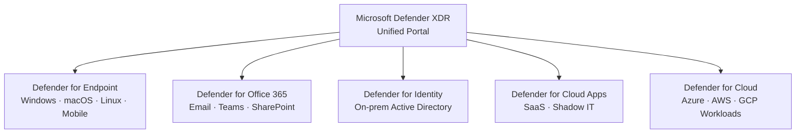
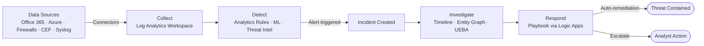

# SC-900 - Security Solutions

!!! info "Exam Weight"
    This topic accounts for approximately **25–30%** of the SC-900 exam.

← **Back to:** [SC-900 Index](index.md)

---

## Microsoft Defender Suite Overview

Microsoft Defender is a family of security products covering endpoints, cloud, identity, email, and more.

| Product | Protects |
|---------|----------|
| **Defender for Endpoint** | Windows/macOS/Linux devices |
| **Defender for Office 365** | Email and collaboration (Exchange, Teams, SharePoint) |
| **Defender for Identity** | On-premises Active Directory / hybrid identity attacks |
| **Defender for Cloud Apps** | SaaS apps (shadow IT, data leakage) |
| **Defender for Cloud** | Azure workloads, servers, containers, databases |
| **Microsoft 365 Defender** (now **Microsoft Defender XDR**) | Unified portal coordinating all above |

---

## Microsoft Defender for Cloud

Protects **Azure, multi-cloud (AWS/GCP), and on-premises** workloads.

### Two Main Capabilities

1. **Cloud Security Posture Management (CSPM)**
    - Continuously assesses your environment.
    - Provides a **Secure Score** (higher = more secure).
    - Gives hardening recommendations.

2. **Cloud Workload Protection (CWP)**
    - Detects and responds to threats against VMs, containers, databases, storage, etc.

### Plans
- **Defender for Cloud (Free)** — Foundational CSPM and Azure Security Center features.
- **Defender for Cloud (Paid plans)** — Enhanced protection per workload type.

---

## Microsoft Sentinel

**Microsoft Sentinel** is a cloud-native **SIEM** (Security Information and Event Management) and **SOAR** (Security Orchestration, Automation, and Response) solution.

### What It Does
- **Collect** — Ingests data from across your entire environment (connectors for 100s of sources).
- **Detect** — Uses built-in and custom analytics rules, ML, and threat intelligence.
- **Investigate** — Incidents, timelines, and entity behavior graphs.
- **Respond** — Automated playbooks (via Azure Logic Apps).

### Key Concepts

| Term | Meaning |
|------|---------|
| **Workspace** | Log Analytics workspace that stores data |
| **Connector** | Data source integration (e.g., Office 365, CEF syslog) |
| **Analytics rule** | Logic that triggers an alert or incident |
| **Incident** | Grouped alerts indicating a security event |
| **Playbook** | Automated response using Logic Apps (SOAR) |
| **Hunting** | Proactive threat searching using KQL queries |
| **UEBA** | User and Entity Behavior Analytics — baseline + anomaly detection |

---

## Microsoft Defender for Endpoint

Protects devices (endpoints) with:

- **Threat & Vulnerability Management** — Discovers vulnerabilities on devices.
- **Attack Surface Reduction (ASR)** — Reduces ways attackers can gain access.
- **Next-gen protection** — Antivirus, anti-malware, behaviour monitoring.
- **Endpoint Detection & Response (EDR)** — Detects and investigates breaches.
- **Automated Investigation & Remediation (AIR)** — Automatically resolves alerts.

> Works with Windows, macOS, Linux, Android, iOS.

---

## Microsoft Defender for Office 365

Protects email and collaboration tools from advanced threats.

| Feature | Description |
|---------|-------------|
| **Safe Attachments** | Detonates attachments in a sandbox before delivery |
| **Safe Links** | Scans URLs at time of click |
| **Anti-phishing** | Detects impersonation and spoof attempts |
| **Attack Simulator** | Run simulated phishing campaigns for training |

### Plans
- **Plan 1** — Safe Attachments, Safe Links, Anti-phishing.
- **Plan 2** — Everything in P1 + Threat Trackers, Attack Simulator, AIR.

---

## Microsoft Defender for Identity

Protects **on-premises Active Directory** from:

- Pass-the-hash / Pass-the-ticket attacks
- Lateral movement
- Privileged account abuse
- Reconnaissance activities

Uses sensors installed on Domain Controllers to monitor AD activity.

---

## Microsoft Defender for Cloud Apps (CASB)

A **Cloud Access Security Broker (CASB)** that provides visibility and control over SaaS apps.

### Four Pillars
1. **Visibility** — Discover all cloud apps in use (Shadow IT).
2. **Data Security** — Apply DLP policies in cloud apps.
3. **Threat Protection** — Detect anomalous user behaviour.
4. **Compliance** — Assess app compliance with regulations.

---

## Azure Firewall

A managed, cloud-native **network security service** that protects Azure Virtual Network resources.

- Stateful firewall with high availability and auto-scaling.
- Filters traffic based on FQDN, IP, and port.
- **Azure Firewall Premium** adds IDPS (Intrusion Detection and Prevention), TLS inspection, and URL filtering.

---

## Azure DDoS Protection

Protects against **Distributed Denial of Service (DDoS)** attacks.

| Tier | Description |
|------|-------------|
| **Network Protection (Basic)** | Automatically enabled for all Azure services, no extra cost |
| **IP Protection** | Per-IP protection with telemetry, alerts, and mitigation |
| **Network Protection (Standard)** | Tenant-wide protection with adaptive tuning and rapid response |

---

## Web Application Firewall (WAF)

Protects web applications from common web exploits (OWASP Top 10).

- Can be deployed on **Azure Application Gateway**, **Azure Front Door**, or **Azure CDN**.
- Operates at Layer 7 (HTTP/HTTPS).

---

## Azure Bastion

Provides **secure RDP/SSH connectivity** to Azure VMs directly from the Azure Portal over TLS — without exposing VMs to the public internet.

---

## Microsoft Entra Permissions Management

Manages permissions across **multi-cloud** environments (Azure, AWS, GCP). Part of the Zero Trust strategy. → [Zero Trust Model](sc-900-security-concepts.md#zero-trust-model)
